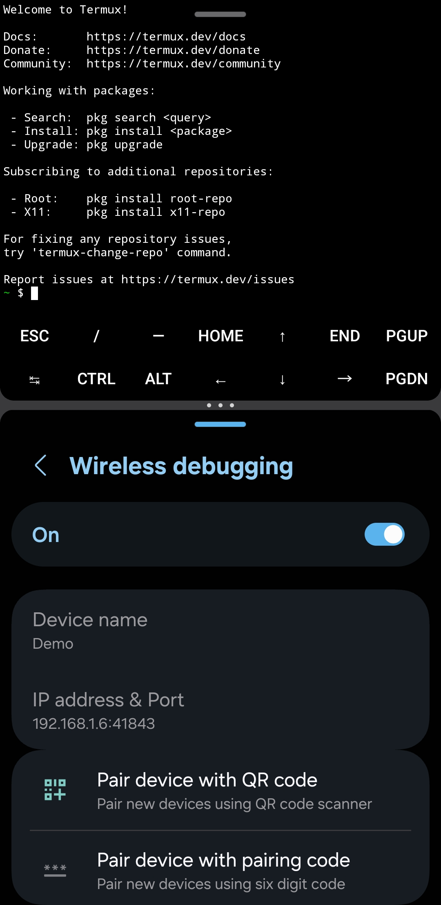

# Troubleshooting [Translated by the Perplexity Comet assistant](https://img.shields.io/badge/Translated_by_Perplexity_Comet_Assistant-gray?logo=data:image/svg+xml;base64,PHN2ZyB4bWxucz0iaHR0cDovL3d3dy53My5vcmcvMjAwMC9zdmciIGhlaWdodD0iMjRweCIgdmlld0JveD0iMCAtOTYwIDk2MCA5NjAiIHdpZHRoPSIyNHB4IiBmaWxsPSIjZmZmZmZmIj48cGF0aCBkPSJtNDc2LTgwIDE4Mi00ODBoODRMOTI0LTgwaC04NGwtNDMtMTIySDYwM0w1NjAtODBoLTg0Wk0xNjAtMjAwbC01Ni01NiAyMDItMjAycS0zNS0zNS02My41LTgwVDE5MC02NDBoODRxMjAgMzkgNDAgNjh0NDggNThxMzMtMzMgNjguNS05Mi41VDQ4NC03MjBINDB2LTgwaDI4MHYtODBoODB2ODBoMjgwdjgwSDU2NHEtMjEgNzItNjMgMTQ4dC04MyAxMTZsOTYgOTgtMzAgODItMTIyLTEyNS0yMDIgMjAxWm00NjgtNzJoMTQ0bC03Mi0yMDQtNzIgMjA0WiIvPjwvc3ZnPg==)

 


[](./../pt-BR/resolucao-de-problemas.md)


| **Start by selecting one of the options below.** |
|--------------------|
|[**Enable Android developer mode**](#enable-android-developer-mode---)|
||
|[**Fixing the forced system stop issue in Termux ‐ `[Process completed (signal 9) ‐ press Enter]`**](#fixing-the-forced-system-stop-issue-in-termux--process-completed-signal-9--press-enter---)|
|  **↳** [**About the issue**](#about-the-issue---)|
|  **↳** [**Disabling Phantom Process on Android 12 and 13**](#disabling-phantom-process-on-android-12-and-13---)|
|    **↳** [**Disable phantom process monitor via feature flags**](#disable-phantom-process-monitor-via-feature-flags---)|
|    **↳** [**Disable phantom process monitor via adb**](#disable-phantom-process-monitor-via-adb---)|
|      **↳** [**Allow Termux to use adb**](#allow-termux-to-use-adb---)|
|      **↳** [**Disabling phantom process monitor via Termux**](#disabling-phantom-process-monitor-via-termux---)|
|  **↳** [**Disabling Phantom Process on Android 14 and 15**](#disabling-phantom-process-on-android-14-and-15---)|
||

# Enable Android developer mode [[ ↑ ]](#)

> [!CAUTION]
> This is a risky area. All settings listed here are system-level modifications. If you don't know what you're doing, find out what each thing does and how to revert the situation before running the commands.
> 
> In some cases, it will be necessary to restore the device to factory settings; in other cases, you may need to reinstall the operating system on the device.
> 
> The `adb` processes may change depending on the device and Android version.

> [!NOTE]
> Steps may change depending on how the device manufacturer chose to position the function.

1. Open system settings;
2. Go to the "about phone" option;
3. Access system information;
4. Tap 5 or more times on the "build number" option until the unlock password prompt appears.
5. Enter the password you use to unlock the device;
6. A toast alert will appear stating that developer mode is active;
7. Go back to the beginning of system settings.

# Fixing the forced system stop issue in Termux ‐ `[Process completed (signal 9) ‐ press Enter]` [[ ↑ ]](#)

## About the issue [[ ↑ ]](#)

> [!CAUTION]
> This is a risky area. All settings listed here are system-level modifications. If you don't know what you're doing, find out what each thing does and how to revert the situation before running the commands.
> 
> In some cases, it will be necessary to restore the device to factory settings; in other cases, you may need to reinstall the operating system on the device.
> 
> The `adb` processes may change depending on the device and Android version.

Since Android 12, Termux and other apps have received restrictions on CPU usage of the device. This is better explained by [Agnostic-apollo in a documentation called "Phantom, Cached And Empty Processes"](https://github.com/agnostic-apollo/Android-Docs/blob/master/en/docs/apps/processes/phantom-cached-and-empty-processes.md). In brief summary, Android is limiting the performance of any app that tries to excessively use the CPU, and because of this restriction, Termux, the app used to install the Linux distribution inside Android, presents the error `[Process completed (signal 9) - press Enter]` and forces the system to stop, forcing the user to restart the app and restart the local server.

Even with this restriction, there are alternatives to disable this restriction, but for this to happen, it will be necessary to have access to the developer options on the phone. In one of the ways, we will use Termux itself, adb, and Wi-Fi debugging from the developer options to disable `settings_enable_monitor_phantom_procs`

> [!NOTE]
> On Samsung's OneUI 7, it will be necessary to disable the automatic blocker in `settings > security and privacy > automatic blocker`. Otherwise, it will not be possible to enable Wi-Fi debugging and the system will create restriction barriers.

## Disabling Phantom Process on Android 12 and 13 [[ ↑ ]](#)

### Disable phantom process monitor via `feature flags` [[ ↑ ]](#)

> [!NOTE]
> Not all devices will have the possibility to use this step.

1. Enable developer options. [The tutorial is here](https://github.com/andistro/app/wiki/3.-Enable-Android-developer-mode);
2. Go to developer options. Usually the last option in your device's settings;
2. Look for the `feature flags` option;
3. Disable the `settings_enable_monitor_phantom_procs` option;

### Disable phantom process monitor via `adb` [[ ↑ ]](#)

#### Allow Termux to use `adb` [[ ↑ ]](#)

> [!CAUTION]
> You will need to use `adb`. Pay attention, as `adb` can make aggressive modifications to the Android system, and in some cases, it will be necessary to restore the device to factory settings or even reinstall the system if you remove something essential for operation. What is said here has already been documented on various portals on the internet, and each manufacturer may create different restrictions on the command.

> [!WARNING]
> If you have never used or don't know `adb`, this documentation will not provide in-depth details about the tool, so I recommend you learn more on other pages, especially Android's.
> - [Android Debug Bridge (adb)](https://developer.android.com/tools/adb)

> [!NOTE]
> `adb` is already installed on the Android system, so it doesn't need to be installed. For this process that aims to solve the `process 9` problem, it will be necessary to use an app that can have developer permissions and can execute the necessary commands to disable phantom processes. In this documentation, Termux itself will be used, but depending on the device, you may need to use a computer.

1. Enable developer options. [The tutorial is here](https://github.com/andistro/app/wiki/3.-Enable-Android-developer-mode);
2. Go to developer options. Usually the last option in your device's settings;
3. Look for the `Wi-Fi debugging` option, open and enable it;
4. Open Termux in multi-window mode;
    <details><summary>Example</summary> <br><a href="./../assets/images/wiki/en-us-adb.jpg" target="_blank">Expand image</a>
    </details>

> [!TIP]
> The order of the windows is not important; what matters is that both apps are in multi-window mode as in the example.

5. In Termux, install the `android-tools` package:
```shell
pkg install android-tools -y
```

6. In Wi-Fi debugging, click on the `pair device with pairing code` option and run the command below in Termux and press `enter` to confirm, but first, pay attention to the conditions below:
```shell
adb pair <IP address and port> <wireless pairing code>
# Example: 
# adb pair localhost:12345 123456
# adb pair 192.168.1.2:12345 123456
```

> [!NOTE]
> Replace `<IP address and port>` with the link that appears below `IP address and port`.
> 
> Replace `<wireless pairing code>` with the code that appears in `Wi-Fi pairing code.`

> [!IMPORTANT]
> The port and pairing code may change when the device screen turns off or when you exit the app, so Termux should be opened in multi-window mode so that the code is not reset before pairing.
> 
> The IP address may be `localhost` and is recommended because if the Wi-Fi network is restarted, the IP address may change and consequently, `adb pair` will not work because it cannot find the link.

> [!NOTE]
> When paired, a success message will appear in English

8. Check the list of paired devices using the `adb devices` command. If the message `List of devices attached` appears and no other message listing paired devices, you should pair Termux to execute `adb` commands.
9. Run the `adb connect` command to reconnect Termux to adb via Wi-Fi
```shell
adb connect <IP address and port>
```

#### Disabling phantom process monitor via Termux [[ ↑ ]](#)

> [!CAUTION]
> As mentioned, all `adb` commands on this page are system modifications and may cause problems that will only be resolved by restoring to factory settings and may even be irreversible. Be careful; if you continue, it will be at your own risk.

> [!NOTE]
> Not all devices have the possibility to use `adb` directly on the device and will depend on a computer with Windows, macOS, or Linux.

1. Check paired devices using the command below. Make sure Termux is paired to continue with the next steps.
```shell
adb devices
```

>[!NOTE]
> If Termux is not connected, follow steps 8, 9, and 10 of the step: [allow Termux to use `adb`](#allow-termux-to-use-adb).

2. Run the following commands:

>[!NOTE]
> Remember to press `enter` when running any of the codes.

```shell
adb shell "/system/bin/device_config set_sync_disabled_for_tests persistent"
```

```shell
adb shell "/system/bin/device_config put activity_manager max_phantom_processes 2147483647"
```

```shell
adb shell settings put global settings_enable_monitor_phantom_procs false
```

Done. You don't need to restart the device, and if you want, you can disable developer options so it doesn't interfere with other apps that don't work when the option is enabled, such as government and banking apps.

>[!NOTE]
> To check if it worked, run the commands below one by one

```bash 
adb shell "/system/bin/dumpsys activity settings | grep max_phantom_processes"
```

```bash
adb shell "/system/bin/device_config get activity_manager max_phantom_processes"
```

>[!NOTE]
> It is expected to return the value `2147483647`

## Disabling Phantom Process on Android 14 and 15 [[ ↑ ]](#)

1. Enable developer options. [The tutorial is here](https://github.com/andistro/app/wiki/3.-Enable-Android-developer-mode);
2. Go to developer options. Usually the last option in your device's settings;
3. Look for `disable secondary process restrictions` and enable the option.

>[!NOTE]
> Unlike `adb`, this requires that `developer options` remain enabled.