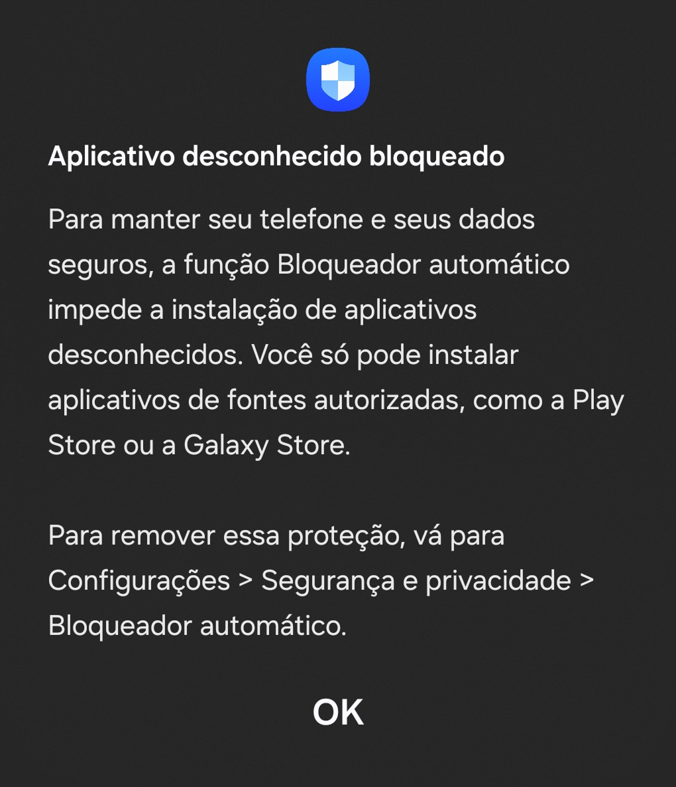

# 📄 **Documentação**

   
<!---->

>ℹ️  
> Aprenda sobre o funcionamento do AnDistro, encontre erros comuns e como resolver aqui nessa documentação.

| **Comece selecionando alguma das opções abaixo.** |
|--------------------|
|[**Informações**](#informações---)|
||
|[**Instalações necessárias**](#instalações-necessárias---)|
||
|[**Iniciando a Instalação do sistema**](#iniciando-a-instalação-do-sistema---)|
||
|[**Resolução de problemas**](/pt-BR/resolucao-de-problemas.md)|
||
|[**DevTools ‐ Padrões de interface de código**](/pt-BR/DevTools.md)|

<!--
h1
|[** **]()|
h1 alt
|**↳** [** **]()|
h2
|  **↳** [** **]()|
h3
|    **↳** [** **]()|
h4
|      **↳** [** **]()|
-->
# Sobre o AnDistro
Nascido da necessidade em usar programas que não tinham versão disponível para Android, o AnDistro surge após a descoberta de poder iniciar o sistema operacional Debian no aparelho sem a preocupação de mexer de forma agressiva no Android. A solução do Termux era suficiente e útil, mas poderia ser complicada para aqueles que poderiam se beneficiar com a solução do proot, mas que não sabem como manusear ou configurar. O AnDistro então é criado para solucionar este problema com um processo de instalação simples, intuitivo e com auto-configuração do que será necessário para começar.

A ferramenta ainda depende do Termux e  funciona dentro do aplicativo, mas utiliza de praticas de UX para tornar o processo de instalação ainda mais intuitivo e para garantir a confiança e segurança, o AnDistro age como um instalador de código aberto para qualquer um ver o seu funcionamento, não hospeda o sistema e baixa diretamente dos servidores do Debian.

> [!NOTE]
> Esse script de instalação foi feito para dispositivos Android com a arquitetura ARM64

# Informações [[ ↑ ]](#)
> As informações podem ser alteradas caso alguém informe melhorias.

||||
|-|-|-|
||Arquitetura|ARM |
||Espaço livre no armazenamento| O AnDistro usará pelo menos 2GB do armazenamento interno do aparelho |
||Memória RAM|Acima de 6GB|
||Versão do Android| 10 ou superior|
||Root|Não é necessário|
||ADB|Necessário a partir do Android 12|
| |Sistema operacional que será instalado | Debian |
||Interface gráfica| XFCE4 e LXDE|

> ⚠️  
> Usar o sistema em um dispositivo mais fraco pode causar sobrecarga e danificar componentes internos devido a alta demanta de processamento.

# Instalações necessárias [[ ↑ ]](#)

Para que tudo funcione corretamente, é necessário a instalação do **Termux**, do **Andronix** e do **AVNC**. O Termux irá instalar e executar a distribuição localmente, o Andronix disponibilizará o script de instalação da distribuição e o AVNC irá visualizar e possibilitar o uso da interface gráfica do Ubuntu.

> ⚠️
> Caso o seu celular seja Samsung e esteja no Android 14 ou superior, será necessário desativar o bloqueador automático em `Configurações > Segurança e Privacidade > Bloqueador automático`. Caso contrário, a instalação será bloqueada.
> 

Cliqe em mim para ver o aviso que irá aparecer caso o bloqueador automático esteja ativo.

|**Onde baixar**|
|------|
||
|**Termux**|
| |
|**AVNC**|
| |
> ⚠️  
> O Termux da Google Play Store está desatualizado e não há mais suporte oficial.

# Iniciando a Instalação do sistema [[ ↑ ]](#)

Após confirmar que o aparelho irá suportar o AnDistro, o primeiro passo será de instalar o Termux em seu aparelho caso ainda não esteja instalado.

> ℹ️  
> Caso o teclado do celular não possua todas as opções necessárias, o AnDistro adiciona automaticamente ao Termux algumas teclas presentes no computador mas que podem não estar presentes no teclado virtual. 

> ⚠️   A sensibilidade ao toque é mais limitada durante a instalação.

> ⚠️   Se aparecer a mensagem: `[Process completed (signal 9) ‐ press Enter]` durante a instalação ou quando o sistema for iniciado, seguir os passos disponíveis na [resolução de problemas](/pt-BR/resolucao-de-problemas.md#corrigindo-o-problema-da-parada-forçada-do-sistema-no-termux--process-completed-signal-9--press-enter---).

1. Baixe os aplicativos informados no acima;
2. Acesse a página de lancamento e copie o comando de instalação do AnDistro;
3. Abra o Termux;
4. Permita tudo que o Termux solicitar;
5. Cole o comando usando a área de transferência do teclado do celular ou pressione na área vazia da tela do Termux e clique no botão `Paste`;
6. Após colar o comando, toque na tela para abrir o teclado caso ainda não esteja aberto e logo após, clique na tecla enter: `(↲)`;
7. O Termux irá executar o comando;
8. Permita e faça tudo que for solicitado na instalação do AnDistro e após finalizar a instalação, o AnDistro será iniciado;
9. Clique em `Instalar o sistema` e confirme com o `enter (↲)` do teclado ou clicando em `< Ok >`;
10. Escolha a interface do sistema, que pode ser a padrão ou a leve. Clique em uma das opções e confirme com o `enter (↲)` do teclado ou clicando em `< Ok >`;
11. Escolha entre o tema claro e escuro. Clique em uma das opções e confirme com o `enter (↲)` do teclado ou clicando em `< Ok >`;
12. Aguarde o AnDistro baixar o Debian e fazer as configurações necessárias. É recomendado que se mantenha com o aplicativo aberto e aguarde a finalização das configurações
13. Será solicitado o idioma do teclado que irá usar. Escolha a opção que mais se adequa a sua necessiade. Caso a opção não apareça, clique em `Outro`  e confirme com o `enter (↲)` do teclado ou clicando em `< Aceitar >` para exibir um outro painel para selecionar o idioma do teclado. Use as setas `↑` e `↓` para rolar a tela para cima ou para baixo e aparecer mais opções. Sempre usar o `enter (↲)` ou `< Aceitar >` para confirmar a seleção.
14. Após finalizar a segunda etapa de configurações, será solicitado para digitar uma senha. Caso deixe vazio, o sistema poderá apresentar falhas. Caso o teclado virtual não fique visível para digitar e não tenha um teclado físico disponível, clique no botão `⌨` para que o teclado virtual apareça.
15. Se a instalação for finalizada com sucesso, aparecerá uma mensagem de de instalação confluida e irá iniciar o sistema Debian.
16. Aparecerá um menu para escolher a resolução. Poderá escolher uma resolução personalizada ou usar uma das opções disponíveis. Sempre usar o `enter (↲)` ou `< Aceitar >` para confirmar a seleção.
> ℹ️ Caso selecione uma resolução 3 vezes seguidas, será perguntado se deseja definir como padrão. A resolução padrão será usada toda vez que iniciar o Debian.
17. Se o servidor for iniciado corretamente, aparecerá a mensagem `o servidor foi iniciado` e logo após, o nome do usuário e o link para poder acessar o Debian usando algum visualizador de VNC. Abaixo, o comando para definir uma nova senha caso tenha esquecido e o comando para finalizar o servidor caso não encerre direto pelo visualizador VNC.
18. Após o servidor Debian ser iniciado, será questionado se deseja abrir o AVNC. Caso queira, clique no `enter (↲)` para confirmar, caso contrário, clique no `ESC` ou clique no `CTRL` e quando ficar azul, clicar no `C` do teclado virtual para cancelar.
