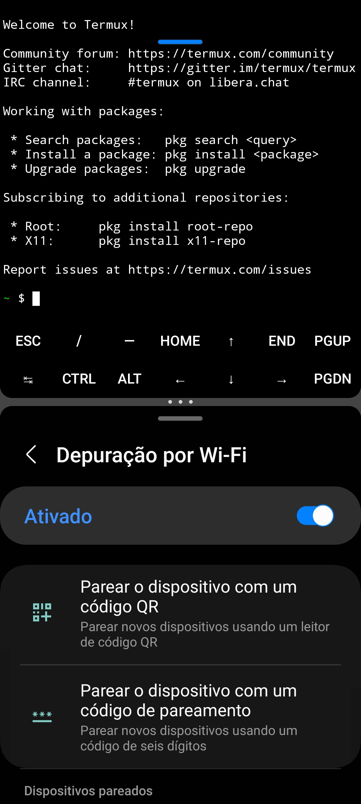

# Resolução de problemas

 


[](./../en-US/troubleshooting.md)


| **Comece selecionando alguma das opções abaixo.** |
|--------------------|
|[**Ativar o modo desenvolvedor do Android**](#Ativar-o-modo-desenvolvedor-do-Android---)|
||
|[**Corrigindo o problema da parada forçada do sistema no Termux ‐ `[Process completed (signal 9) ‐ press Enter]`**](#corrigindo-o-problema-da-parada-forçada-do-sistema-no-termux--process-completed-signal-9--press-enter---)|
|  **↳** [**Sobre o problema**](#Sobre-o-problema---)|
|  **↳** [**Desabilitando o Phantom Process no Android 12 e 13**](#desabilitando-o-phantom-process-no-android-12-e-13---)|
|    **↳** [**Desativar o monitor de processos fantasmas pelo sinalizadores de recursos**](#desativar-o-monitor-de-processos-fantasmas-pelo-sinalizadores-de-recursos---)|
|    **↳** [**Desativar o monitor de processos fantasmas pelo adb**](#desativar-o-monitor-de-processos-fantasmas-pelo-adb---)|
|      **↳** [**Permitir que o Termux use o adb**](#permitir-que-o-termux-use-o-adb---)|
|      **↳** [**Desativando o monitor de processos fantasmas pelo Termux**](#desativando-o-monitor-de-processos-fantasmas-pelo-termux---)|
|  **↳** [**Desabilitando o Phantom Process no Android 14 e 15**](#desabilitando-o-phantom-process-no-android-14-e-15---)|
||
|[**Problemas do Firefox**](#problemas-do-firefox---)|
|  **↳** [**Repositório**](#repositório---)|
|  **↳** [**Erro de inicialização do Firefox**](#erro-de-inicialização-do-firefox---)|
|    **↳** [**Método 1 - pelo `about:config`**](#método-1---pelo-aboutconfig---)|
|    **↳** [**Método 2 - pelo terminal**](#método-2---pelo-terminal---)|
||
|[**Lista de fontes `apt`**](#lista-de-fontes-apt---)|
|  **↳** [**Debian**](#debian---)|


<!--
h1
|[** **]()|
h1 alt
|**↳** [** **]()|
h2
|  **↳** [** **]()|
h3
|    **↳** [** **]()|
h4
|      **↳** [** **]()|
-->


# Ativar o modo desenvolvedor do Android [[ ↑ ]](#)

> [!CAUTION]
> Esta é uma área de risco. Todas as configurações aqui listadas são modificações de nível de sistema. Caso não saiba o que está fazendo, busque descobrir o que cada coisa faz e como poder reverter a situação antes de executar os comandos. <br>
> Em alguns casos será necessário restaurar o aparelho aos padrões de fábrica, em outros casos poderão ser necessário ter que reinstalar o sistema operacional novamente no aparelho. <br>
> Os processos de `adb` podem sofrer alterações a depender do aparelho e versão do Android.

> [!NOTE]
> Os passos podem mudar a depender de como o fabricante do dispositivo optou em posicionar a função.

1. Abrir as configurações do sistema;
2. Ir até opção "sobre o telefone";
3. Acessar as informações do sistema;
4. Clicar 5 ou mais vezes na opção chamada "número de compilação" até aparecer a solicitação de senha de desbloqueio.
5. Digite a senha que usa para desbloquear o aparelho;
6. Aparecerá um alerta toast de que o modo desenvolvedor está ativo;
7. Volte para o início das configurações do sistema.

# Corrigindo o problema da parada forçada do sistema no Termux ‐ `[Process completed (signal 9) ‐ press Enter]` [[ ↑ ]](#)

## Sobre o problema [[ ↑ ]](#)

> [!CAUTION]
> Esta é uma área de risco. Todas as configurações aqui listadas são modificações de nível de sistema. Caso não saiba o que está fazendo, busque descobrir o que cada coisa faz e como poder reverter a situação antes de executar os comandos. <br>
> Em alguns casos será necessário restaurar o aparelho aos padrões de fábrica, em outros casos poderão ser necessário ter que reinstalar o sistema operacional novamente no aparelho. <br>
> Os processos de `adb` podem sofrer alterações a depender do aparelho e versão do Android.


Desde o Android 12, o Termux e outros aplicativos receberam restrições sobre o uso da CPU do aparelho. Isso é melhor explicado pelo [Agnostic-apollo em uma documentação chamada de "Phantom, Cached And Empty Processes"](https://github.com/agnostic-apollo/Android-Docs/blob/master/en/docs/apps/processes/phantom-cached-and-empty-processes.md). Em um breve resumo, o Android está limitando o desempenho de qualquer aplicativo que tente usar de forma excessiva a CPU e por causa dessa restrição, o Termux, app usado para instalar a distribuição Linux dentro do Android apresenta o erro `[Process completed (signal 9) - press Enter]` e força a parada do sistema, forçando o usuário a reiniciar o aplicativo e reiniciar o servidor local.

Mesmo com esta restrição, existe alternativas para podermos desabilitar esta restrição, mas para isso acontecer será necessário ter acesso às opções de desenvolvedor do celular. Em uma das formas será usando o próprio Termux, adb e a depuração Wi-Fi das opções do desenvolvedor para desabilitar o `settings_enable_monitor_phantom_procs`

> [!NOTE]
> Na OneUI 7 da Samsung, será necessário desabilitar o bloqueador automático em `configurações > segurança e privacidade > bloqueador automático`. Caso contrário, não será possível habilitar à depuração Wi-Fi e o sistema irá criar barreiras de restrição.

<br><br>

## Desabilitando o Phantom Process no Android 12 e 13 [[ ↑ ]](#)

### Desativar o monitor de processos fantasmas pelo `sinalizadores de recursos` [[ ↑ ]](#)

> [!NOTE]
> Nem todos os dispositivos terão a possibilidade de usar esse passo.
1. Ative as opções do desenvolvedor. [O tutorial está aqui](https://github.com/andistro/app/wiki/3.-Ativar-o-modo-desenvolvedor-do-Android);
2. Vá até as opções do desenvolvedor. Normalmente é a última opção das configurações do seu aparelho;
2. Procure pela opção `sinalizadores de recursos`;
3. Desative a opção `settings_enable_monitor_phantom_procs`;
<br><br>

### Desativar o monitor de processos fantasmas pelo `adb`[[ ↑ ]](#)

#### Permitir que o Termux use o `adb`[[ ↑ ]](#) 

> [!CAUTION]
> Será necessário usar o `adb`. Atente-se, pois, o `adb` pode fazer modificações agressivas no sistema Android e em alguns casos será necessário restaurar o aparelho aos padrões de fabrica ou até mesmo fazer uma reinstalação do sistema caso remova algo essencial para o funcionamento. O que será dito aqui já foi documentado em vários portais na internet cada fabricante poderá criar diferentes restrições encima do comando.

> [!WARNING]
> Se nunca usou ou nem conheçe o `adb`, essa documentação não trará detalhes aprofundados sobre a ferramenta e por isso, recomendo que se aprofunde mais em outras páginas, principalmente na do Android.
> - [Android Debug Bridge (adb)](https://developer.android.com/tools/adb)

> [!NOTE]
> O `adb` já vem instalado no sistema Android, portanto não precisa ser instalado. Para esse processo que visa resolver o problema do `process 9` será necessesário usar um app que possa ter permissões de desenvolvedor e que possa executar os comandos necessários para desativar o os processos fantasmas. Nessa documentação, será usado o próprio Termux, mas dependendo do aparelho, poderá ser necessário utilizar um computador.


1. Ative as opções do desenvolvedor. [O tutorial está aqui](https://github.com/andistro/app/wiki/3.-Ativar-o-modo-desenvolvedor-do-Android);
2. Vá até as opções do desenvolvedor. Normalmente é a última opção das configurações do seu aparelho;
3. Procure pela opção `depuração por wi-fi` abra e ative-a;
4. Abra o Termux como multi janela;
    <details><summary>Exemplo</summary><br><a href="./../assets/images/wiki/pt-br-adb.png" target="_blank">Expandir imagem</a></details>
> [!TIP]
> A ordem das janelas não é importante, o que importa é que os dois apps esteja em multi-janela como no exemplo.

5. No Termux, instale o pacote `android-tools`:
```shell
pkg install android-tools -y
```
6. Em depuração Wi-FI, clique na opção `parear o dispositivo com um código de pareamento` e execute o comando abaixo no Termux e tecle `enter` para confirmar, mas primeiro, se atente às condições abaixo:
```shell
adb pair <IP Address and port> <wireless pairing code>
# Exemplo: 
# adb pair localhost:12345 123456
# adb pair 192.168.1.2:12345 123456
```
> [!NOTE]
> Trocar o `<IP Address and port>` pelo link que aparece abaixo de `endereço IP e porta`. <br>
> Trocar o <wireless pairing code> pelo código que aparece em `código de pareamento por Wi-Fi.`

> [!IMPORTANT]
> A porta e código de pareamento podem mudar quando a tela do aparelho apagar ou quando sair do aplicativo e por isso que o Termux deve ser aberto em multi janela, para que o código não seja reiniciado antes do pareamento.<br>
> O endereço IP poderá ser `localhost` e é recomendado porque se a rede Wi-Fi for reiniciada, o endereço IP poderá ser alterado e consecutivamente, o `adb pair` não irá funcionar por não encontrar o link.

> [!NOTE]
> Quando pareado, aparecerá uma mensagem de sucesso em inglês

8. Verifique a lista de dispositivos pareados usando o comando `adb devices`. Caso apareça a mensagem `List of devices attached` e mais nenhuma outra mensagem listando os dispositivos pareados, deverá fazer o pareamento do Termux para executar os comandos `adb`.
9. Execute o comando `adb connect` para reconectar o Termux ao adb via WI-FI
```shell
adb connect <IP Address and port>
```
#### Desativando o monitor de processos fantasmas pelo Termux [[ ↑ ]](#)

> [!CAUTION]
> Como informado, todos os comandos de `adb` presentes nessa página são de modificação do sistema e os mesmos podem causar problemas que só serão resolvidos em caso de restauração aos padrões de fábrica e talvez até sejam irreversíveis. Tome cuidado, se continuar será por sua conta e risco.

> [!NOTE]
> Nem todos os aparelhos tem a possibilidade de usar o `adb` diretamente no dispositivo e serão dependentes de um computador com Windows, macOS ou Linux.

1. Verifique os dispositivos pareados usando o comando abaixo. Certifique que Termux esteja pareado para continuar os próximos passos.
```shell
adb devices
```
>[!NOTE]
> Caso o Termux não esteja conectado, siga os passos do item 8, 9 e 10 do passo: [dar as permissões de `adb` para o Termux](#dar-as-permissões-de-adb-para-o-termux).

2. Execute os seguintes comandos:
>[!NOTE]
> Lembre-se de teclar `enter` quando executar qualquer um dos códigos.

```shell
adb shell "/system/bin/device_config set_sync_disabled_for_tests persistent"
```
```shell
adb shell "/system/bin/device_config put activity_manager max_phantom_processes 2147483647"
```
<!-- este comando irá mostra executou: adb shell "/system/bin/device_config list activity_manager" -->

```shell
adb shell settings put global settings_enable_monitor_phantom_procs false
```
Pronto. Não será necessário reiniciar o aparelho e caso deseje, poderá desativar as opções do desenvolvedor para não implicar com outros aplicativos que não funcionam quando a opção está habilitada, como exemplo, apps governamentais e bancários.

>[!NOTE]
> Para verificar se funcionou, execute os comandos abaixo um por um
```bash 
adb shell "/system/bin/dumpsys activity settings | grep max_phantom_processes"
```
```bash
adb shell "/system/bin/device_config get activity_manager max_phantom_processes"
```
>[!NOTE]
> Esperasse que retorne o valor `2147483647`


<br><br><br>

## Desabilitando o Phantom Process no Android 14 e 15 [[ ↑ ]](#)
1. Ative as opções do desenvolvedor. [O tutorial está aqui](https://github.com/andistro/app/wiki/3.-Ativar-o-modo-desenvolvedor-do-Android);
2. Vá até as opções do desenvolvedor. Normalmente é a última opção das configurações do seu aparelho;
3. Procure por `desabilitar restrições do processo secundário` e habilite a opção.

>[!NOTE]
> Diferente do `adb`, este necessita que as `opções do desenvolvedor` se mantenham ativada.


# Problemas do Firefox [[ ↑ ]](#)

## Repositório [[ ↑ ]](#)

O Firefox, assim como outros, estão adotando o repositório `snap` que não funciona no Termux. Uma alternativa é adicionar repositórios deb de forma manual.

O código para adicionar o repositório deb do Firefox:

```bash
sudo apt install wget -y
sudo install -d -m 0755 /etc/apt/keyrings
wget -q https://packages.mozilla.org/apt/repo-signing-key.gpg -O- | sudo tee /etc/apt/keyrings/packages.mozilla.org.asc > /dev/null
echo "deb [signed-by=/etc/apt/keyrings/packages.mozilla.org.asc] https://packages.mozilla.org/apt mozilla main" | sudo tee -a /etc/apt/sources.list.d/mozilla.list
echo -e "\nPackage: *\nPin: origin packages.mozilla.org\nPin-Priority: 1000" | sudo tee /etc/apt/preferences.d/mozilla
sudo apt update
sudo apt install firefox
```

## Erro de inicialização do Firefox [[ ↑ ]](#)

O Firefox demostrou apresentar alguns problemas ao ser iniciado pela primeira vez em servidores VNC, mas é um problema que pode ser contornado.

### Método 1 - pelo `about:config` [[ ↑ ]](#)

Apesar do problema evitar que o Firefox consiga inicializar corretamente, o `about:config` ainda pode ser usado. Nesse caso, poderá digitar o endereço na barra de URL no navegador, clicar no enter. O navegador apresentará uma mensagem de confirmação de acesso por ser se tratar de configurações avançadas do navegador. Autorize e procure pelo `security.sandbox.content.level` e troque o valor por `0`.

### Método 2 - pelo terminal [[ ↑ ]](#)

Uma outra solução é pelo terminal. Aqui no AnDistro esse método já é usado de forma automática, então o problema não deverá ser apresentado a menos que haja algum erro de instalação ou caso seja feita a reinstalação do Firefox. O código usado é esse abaixo:

```bash
firefox > /dev/null 2>&1 & PID=$!; sleep 5; kill $PID # Inicia o Firefox e finaliza de forma automática, para que seja gerado os releases
sed -i '/security.sandbox.content.level/d' ~/.mozilla/firefox/*.default-release/prefs.js # Substitui o valor do security.sandbox.content.level por 0
echo "user_pref(\"security.sandbox.content.level\", 0);" >> ~/.mozilla/firefox/*.default-release/prefs.js # Caso o security.sandbox.content.level não exista, será criado.
```

# Lista de fontes `apt` [[ ↑ ]](#)

## Debian [[ ↑ ]](#)

```bash
echo 'deb http://deb.debian.org/debian <codinome> main contrib non-free non-free-firmware
deb http://security.debian.org/debian-security <codinome>-security main contrib non-free
deb http://deb.debian.org/debian <codinome>-updates main contrib non-free' >> /etc/apt/sources.list
```